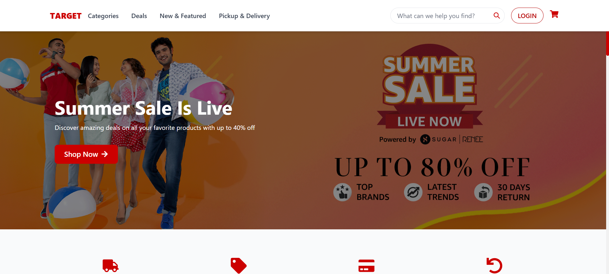

# TARGET Web App Clone

A full-featured web application that replicates Target's online shopping experience, built with modern web technologies and a responsive design.

## 🌐 Live Demo
[Visit the live site](https://targetclone.netlify.app/)

## 📱 App Preview

### Desktop View


### Mobile View


## ✨ Features

- **Modern UI/UX**: A clean, responsive interface that matches Target's design language
- **Product Categories**: Browse products across multiple categories including:
  - Men's & Women's Clothing
  - Electronics & Appliances
  - Home Decor & Furniture
  - Grocery & Health
  - Deals & New Arrivals
- **Shopping Features**:
  - Product search and filtering
  - Shopping cart management with persistent storage
  - Pickup & Delivery options
  - Dynamic product details
- **Responsive Design**: Fully responsive layout that works on desktop and mobile devices
- **Authentication**: User login/logout functionality with persistent sessions

## 🛠️ Tech Stack

### Frontend
- **Core**: React.js 18.2.0
- **UI Framework**: Chakra UI 2.8.2
- **Styling**:
  - @emotion/react & @emotion/styled 11.11.x
  - Framer Motion 11.2.10
- **Routing**: React Router DOM 6.23.1
- **HTTP Client**: Axios 1.7.2
- **Icons**: 
  - @chakra-ui/icons
  - react-icons 5.2.1
- **Build Tool**: Vite 5.2.0

### Backend
- **Server**: Express 4.18.2
- **Mock API**: json-server 0.17.4
- **Middleware**: CORS 2.8.5

### Development
- **Package Manager**: npm
- **Dev Server**: Vite dev server (frontend) + json-server (backend)
- **Linting**: ESLint with multiple plugins
- **Node Version**: >= 18.0.0

## 📁 Project Structure

```
target_web_app/
├── frontend/                # React frontend application
│   ├── src/
│   │   ├── assets/         # Images and static assets
│   │   │   └── images/     # Image service and utilities
│   │   ├── components/     # Reusable UI components
│   │   ├── context/        # React Context providers
│   │   ├── pages/          # Page components
│   │   ├── styles/         # CSS and style files
│   │   ├── utils/          # Utility functions
│   │   ├── App.jsx        # Main App component
│   │   └── main.jsx       # Application entry point
│   ├── public/             # Public assets
│   └── package.json        # Frontend dependencies
├── backend/                # Express + JSON Server backend
│   ├── assets/            # Backend static assets
│   ├── db.json            # Mock database
│   ├── server.js          # Server configuration
│   └── package.json       # Backend dependencies
├── target_homepage.png    # Desktop screenshot
├── target_mobile.png      # Mobile screenshot
├── start-app.bat          # Windows startup script
└── package.json           # Root package.json for scripts
```

## 📦 Installation

1. Clone the repository:
   ```bash
   git clone https://github.com/arnabAdhikary98/target_web_app.git
   cd target_web_app
   ```

2. Install all dependencies:
   ```bash
   npm run install-deps
   ```

3. Start development servers:
   ```bash
   # Run both frontend and backend in development mode
   npm run dev

   # Or run them separately:
   npm run dev:server   # Backend only
   npm run dev:client   # Frontend only
   ```

4. Open [http://localhost:3000](http://localhost:3000) to view the app

## 🚀 Deployment

The application is set up for easy deployment:

1. Build the frontend:
   ```bash
   npm run build
   ```

2. Deploy both frontend and backend:
   ```bash
   npm run deploy
   ```

## 🧪 Testing

Run tests with:
```bash
npm run test:all            # Run all tests
npm run test:frontend       # Frontend tests only
npm run test:frontend:coverage  # Frontend tests with coverage
```

## 🤝 Contributing

Contributions are welcome! Here's how you can help:

1. Fork the repository
2. Create your feature branch: `git checkout -b feature/YourFeature`
3. Commit your changes: `git commit -m 'Add YourFeature'`
4. Push to the branch: `git push origin feature/YourFeature`
5. Open a Pull Request

Please make sure to update tests as appropriate and follow the existing code style.

## 📄 License

This project is open source and available under the [MIT License](LICENSE).

---
Built with ❤️ by [Arnab Adhikary](https://github.com/arnabAdhikary98)
